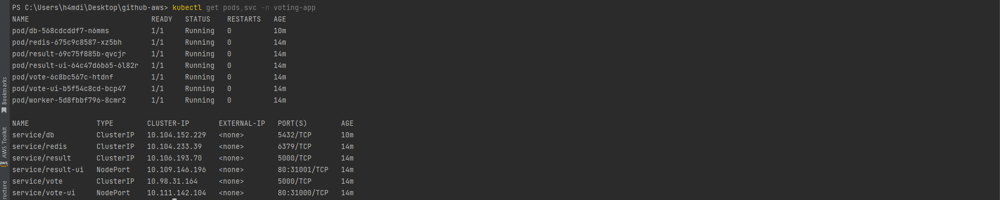
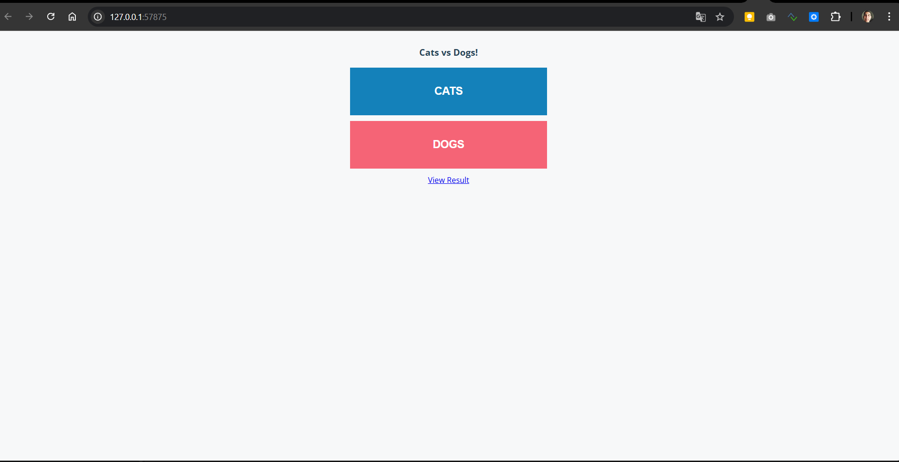
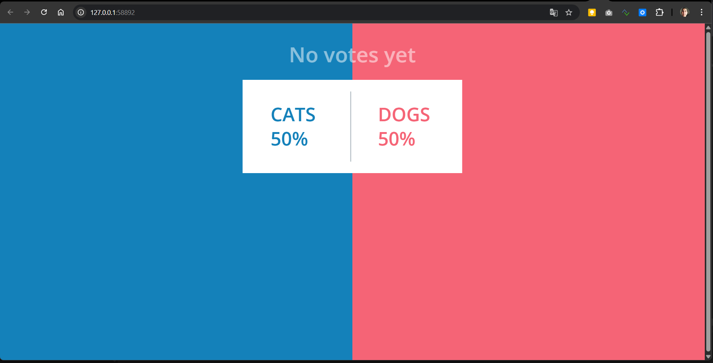
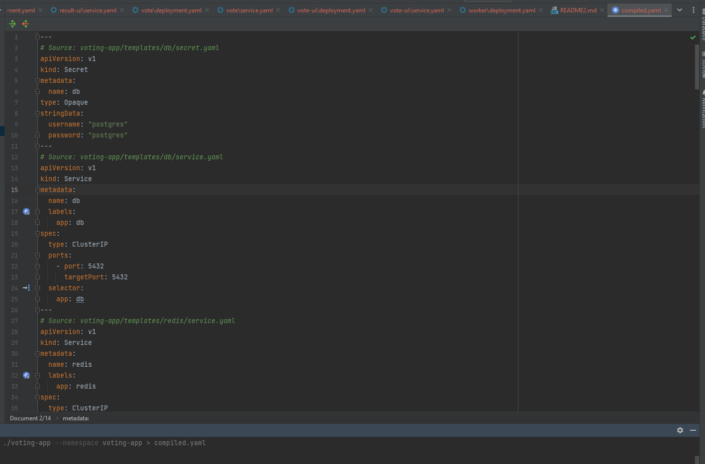
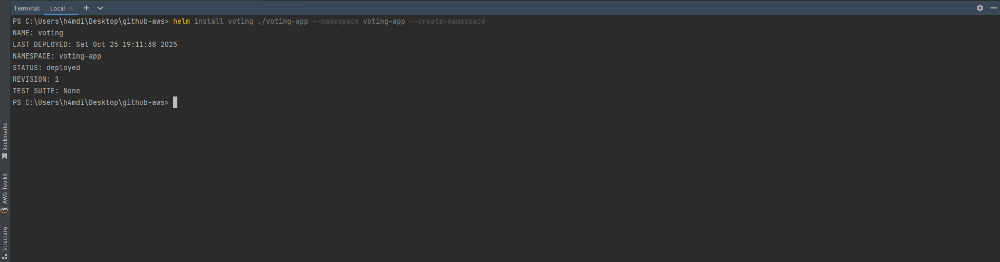

# **Complete Lab (part1) – From Docker Compose to Kubernetes and Helm Packaging**

---

## **Objectives**

By the end of this lab, you will:

* Translate each service from a Docker Compose stack into Kubernetes manifests.
* Organize and deploy the Voting App on a Kubernetes cluster.
* Package all manifests into a Helm chart for reuse.

---

## **1. Background**

**Docker Compose** allows defining multi-container apps easily for local use.
**Kubernetes** provides the production-ready equivalent — but requires explicit definitions.

| Concept               | Docker Compose | Kubernetes Equivalent           |
| --------------------- | -------------- | ------------------------------- |
| Container definition  | `services:`    | `Deployment`                    |
| Networking            | `networks:`    | `Service` (ClusterIP/NodePort)  |
| Dependencies          | `depends_on:`  | Service DNS + startup order     |
| Environment variables | `environment:` | `env` or `ConfigMap/Secret`     |
| Persistent data       | `volumes:`     | `PersistentVolumeClaim`         |
| Port exposure         | `ports:`       | `Service` (NodePort or Ingress) |

You’ll convert the **Voting App** step by step, keeping the logic clear and minimal.

---

## **2. Starting Point: Your Docker Compose File**

Simplified version:

```yaml
services:
  vote:
    image: docker.io/${DOCKERHUB_USERNAME}/vote:${IMAGE_TAG}
    depends_on: [redis]
  vote-ui:
    image: docker.io/${DOCKERHUB_USERNAME}/vote-ui:${IMAGE_TAG}
    ports: ["5000:80"]
  result:
    image: docker.io/${DOCKERHUB_USERNAME}/result:${IMAGE_TAG}
    depends_on: [db]
  result-ui:
    image: docker.io/${DOCKERHUB_USERNAME}/result-ui:${IMAGE_TAG}
    ports: ["5001:80"]
  worker:
    image: docker.io/${DOCKERHUB_USERNAME}/worker:${IMAGE_TAG}
    depends_on: [redis, db]
  redis:
    image: redis:7.0.7-alpine3.17
    ports: ["6379:6379"]
  db:
    image: postgres:15.0-alpine3.16
    environment:
      POSTGRES_USER: postgres
      POSTGRES_PASSWORD: postgres
```

---

## **3. Create a Folder for Kubernetes Manifests**

```bash
mkdir k8s
mkdir k8s/vote, k8s/vote-ui, k8s/result, k8s/result-ui, k8s/worker, k8s/redis, k8s/db
```

Each subfolder will contain its own `deployment.yaml` and `service.yaml`.

---

## **4. Translate Each Service**

---

### **4.1 PostgreSQL (db)**

**Compose → Deployment + Service + Secret**

#### Secret (`k8s/db/secret.yaml`)

```yaml
apiVersion: v1
kind: Secret
metadata:
  name: db
  namespace: voting-app
type: Opaque
stringData:
  username: postgres
  password: postgres
```

#### Deployment (`k8s/db/deployment.yaml`)

```yaml
apiVersion: apps/v1
kind: Deployment
metadata:
  name: db
  namespace: voting-app
  labels:
    app: db
spec:
  replicas: 1
  selector:
    matchLabels:
      app: db
  template:
    metadata:
      labels:
        app: db
    spec:
      containers:
        - name: db
          image: postgres:15.0-alpine3.16
          ports:
            - containerPort: 5432
          env:
            - name: POSTGRES_USER
              valueFrom:
                secretKeyRef:
                  name: db
                  key: username
            - name: POSTGRES_PASSWORD
              valueFrom:
                secretKeyRef:
                  name: db
                  key: password
```

#### Service (`k8s/db/service.yaml`)

```yaml
apiVersion: v1
kind: Service
metadata:
  name: db
  namespace: voting-app
  labels:
    app: db
spec:
  type: ClusterIP
  ports:
    - port: 5432
      targetPort: 5432
  selector:
    app: db
```

**Hint:**
ClusterIP makes it reachable from inside the cluster (`db:5432`).
Use NodePort only for frontends that users must access.

---

### **4.2 Redis**

#### Deployment (`k8s/redis/deployment.yaml`)

```yaml
apiVersion: apps/v1
kind: Deployment
metadata:
  name: redis
  namespace: voting-app
  labels:
    app: redis
spec:
  replicas: 1
  selector:
    matchLabels:
      app: redis
  template:
    metadata:
      labels:
        app: redis
    spec:
      containers:
        - name: redis
          image: redis:7.0.7-alpine3.17
          ports:
            - containerPort: 6379
```

#### Service (`k8s/redis/service.yaml`)

```yaml
apiVersion: v1
kind: Service
metadata:
  name: redis
  namespace: voting-app
  labels:
    app: redis
spec:
  type: ClusterIP
  ports:
    - port: 6379
      targetPort: 6379
  selector:
    app: redis
```

---

### **4.3 Vote**

#### Deployment (`k8s/vote/deployment.yaml`)

```yaml
apiVersion: apps/v1
kind: Deployment
metadata:
  name: vote
  namespace: voting-app
  labels:
    app: vote
spec:
  replicas: 1
  selector:
    matchLabels:
      app: vote
  template:
    metadata:
      labels:
        app: vote
    spec:
      containers:
        - name: vote
          image: voting/vote:v1.0.13
          ports:
            - containerPort: 5000
          env:
            - name: REDIS_HOST
              value: redis
```

#### Service (`k8s/vote/service.yaml`)

```yaml
apiVersion: v1
kind: Service
metadata:
  name: vote
  namespace: voting-app
  labels:
    app: vote
spec:
  type: ClusterIP
  ports:
    - port: 5000
      targetPort: 5000
  selector:
    app: vote
```

---

### **4.4 Vote UI**

#### Deployment (`k8s/vote-ui/deployment.yaml`)

```yaml
apiVersion: apps/v1
kind: Deployment
metadata:
  name: vote-ui
  namespace: voting-app
  labels:
    app: vote-ui
spec:
  replicas: 1
  selector:
    matchLabels:
      app: vote-ui
  template:
    metadata:
      labels:
        app: vote-ui
    spec:
      containers:
        - name: vote-ui
          image: voting/vote-ui:v1.0.19
          ports:
            - containerPort: 80
```

#### Service (`k8s/vote-ui/service.yaml`)

```yaml
apiVersion: v1
kind: Service
metadata:
  name: vote-ui
  namespace: voting-app
  labels:
    app: vote-ui
spec:
  type: NodePort
  ports:
    - port: 80
      targetPort: 80
      nodePort: 31000
  selector:
    app: vote-ui
```

**Hint:**
NodePort exposes it externally via any worker node IP:
`http://<node-ip>:31000`

---

### **4.5 Result**

#### Deployment (`k8s/result/deployment.yaml`)

```yaml
apiVersion: apps/v1
kind: Deployment
metadata:
  name: result
  namespace: voting-app
  labels:
    app: result
spec:
  replicas: 1
  selector:
    matchLabels:
      app: result
  template:
    metadata:
      labels:
        app: result
    spec:
      containers:
        - name: result
          image: voting/result:v1.0.16
          ports:
            - containerPort: 5000
          env:
            - name: POSTGRES_USER
              valueFrom:
                secretKeyRef:
                  name: db
                  key: username
            - name: POSTGRES_PASSWORD
              valueFrom:
                secretKeyRef:
                  name: db
                  key: password
```

#### Service (`k8s/result/service.yaml`)

```yaml
apiVersion: v1
kind: Service
metadata:
  name: result
  namespace: voting-app
  labels:
    app: result
spec:
  type: ClusterIP
  ports:
    - port: 5000
      targetPort: 5000
  selector:
    app: result
```

---

### **4.6 Result UI**

#### Deployment (`k8s/result-ui/deployment.yaml`)

```yaml
apiVersion: apps/v1
kind: Deployment
metadata:
  name: result-ui
  namespace: voting-app
  labels:
    app: result-ui
spec:
  replicas: 1
  selector:
    matchLabels:
      app: result-ui
  template:
    metadata:
      labels:
        app: result-ui
    spec:
      containers:
        - name: result-ui
          image: voting/result-ui:v1.0.15
          ports:
            - containerPort: 80
```

#### Service (`k8s/result-ui/service.yaml`)

```yaml
apiVersion: v1
kind: Service
metadata:
  name: result-ui
  namespace: voting-app
  labels:
    app: result-ui
spec:
  type: NodePort
  ports:
    - port: 80
      targetPort: 80
      nodePort: 31001
  selector:
    app: result-ui
```

---

### **4.7 Worker**

#### Deployment (`k8s/worker/deployment.yaml`)

```yaml
apiVersion: apps/v1
kind: Deployment
metadata:
  name: worker
  namespace: voting-app
  labels:
    app: worker
spec:
  replicas: 1
  selector:
    matchLabels:
      app: worker
  template:
    metadata:
      labels:
        app: worker
    spec:
      containers:
        - name: worker
          image: voting/worker:v1.0.15
          env:
            - name: POSTGRES_USER
              valueFrom:
                secretKeyRef:
                  name: db
                  key: username
            - name: POSTGRES_PASSWORD
              valueFrom:
                secretKeyRef:
                  name: db
                  key: password
            - name: REDIS_HOST
              value: redis
            - name: DB_HOST
              value: db
```

**Hint:**
The worker is internal. It doesn’t expose a Service because it only communicates via Redis and DB.

---

## **5. Deploy the Full Stack**

Apply all manifests:

```bash
kubectl create ns voting-app
kubectl apply -R -f k8s/
kubectl get pods,svc -n voting-app
```



Check NodePort access:

```
minikube service vote-ui -n parking-dev
minikube service result-ui -n parking-dev
```




---

## **6. Package into a Helm Chart**

Now that the plain manifests work, let’s turn them into a Helm chart.

### **6.1 Create Chart Skeleton**

```bash
helm create voting-app
```

This creates:

```
voting-app/
├── Chart.yaml
├── values.yaml
└── templates/
```
Delete the sample files inside templates/ to avoid confusion:

```yaml
rm -Recurse -Force voting-app\templates\*
```

---

### **6.2 Move and Template Your Manifests**

Copy the working YAML files into `templates/`.

You already have working YAMLs in:

```
k8s/
├── vote/
├── result/
├── vote-ui/
├── result-ui/
├── worker/
├── redis/
└── db/
```

Copy them into the Helm `templates/` folder, keeping subdirectories for clarity:

```bash
cp -r k8s/* voting-app/templates/
```

Your chart now looks like:

```
voting-app/
├── Chart.yaml
├── values.yaml
└── templates/
    ├── vote/
    ├── vote-ui/
    ├── result/
    ├── result-ui/
    ├── worker/
    ├── redis/
    └── db/
```
> Helm recursively reads all YAMLs under `templates/`.
> This structure avoids overwriting files like `deployment.yaml`.

### **6.3 Replace Hardcoded Values with Template Variables**

Now convert your manifests into Helm templates.

Example: original Deployment from `k8s/vote/deployment.yaml`:

```yaml
apiVersion: apps/v1
kind: Deployment
metadata:
  name: vote
  namespace: voting-app
  labels:
    app: vote
spec:
  replicas: 1
  selector:
    matchLabels:
      app: vote
  template:
    metadata:
      labels:
        app: vote
    spec:
      containers:
        - name: vote
          image: voting/vote:v1.0.13
          ports:
            - containerPort: 5000
          env:
            - name: REDIS_HOST
              value: redis
```

Convert it into a Helm-templated version (`templates/vote/deployment.yaml`):

```yaml
apiVersion: apps/v1
kind: Deployment
metadata:
  name: vote
  labels:
    app: vote
spec:
  replicas: {{ .Values.vote.replicas }}
  selector:
    matchLabels:
      app: vote
  template:
    metadata:
      labels:
        app: vote
    spec:
      containers:
        - name: vote
          image: "{{ .Values.vote.image.repository }}:{{ .Values.vote.image.tag }}"
          ports:
            - containerPort: {{ .Values.vote.containerPort }}
          env:
            - name: REDIS_HOST
              value: {{ .Values.vote.env.redisHost | quote }}
```

---

#### Parameterize Services

Example (`templates/vote/service.yaml`):

```yaml
apiVersion: v1
kind: Service
metadata:
  name: vote
  labels:
    app: vote
spec:
  type: {{ .Values.vote.service.type }}
  ports:
    - port: {{ .Values.vote.service.port }}
      targetPort: {{ .Values.vote.service.targetPort }}
  selector:
    app: vote

```
Here’s the continuation for the **remaining Voting App Helm templates** :

### `templates/vote-ui/deployment.yaml`

```yaml
apiVersion: apps/v1
kind: Deployment
metadata:
  name: vote-ui
  labels:
    app: vote-ui
spec:
  replicas: {{ .Values.voteUi.replicas }}
  selector:
    matchLabels:
      app: vote-ui
  template:
    metadata:
      labels:
        app: vote-ui
    spec:
      containers:
        - name: vote-ui
          image: "{{ .Values.voteUi.image.repository }}:{{ .Values.voteUi.image.tag }}"
          ports:
            - containerPort: {{ .Values.voteUi.containerPort }}
```

### `templates/vote-ui/service.yaml`

```yaml
apiVersion: v1
kind: Service
metadata:
  name: vote-ui
  labels:
    app: vote-ui
spec:
  type: {{ .Values.voteUi.service.type }}
  ports:
    - port: {{ .Values.voteUi.service.port }}
      targetPort: {{ .Values.voteUi.service.targetPort }}
      {{- if eq .Values.voteUi.service.type "NodePort" }}
      nodePort: {{ .Values.voteUi.service.nodePort }}
      {{- end }}
  selector:
    app: vote-ui
```

---

### `templates/result/deployment.yaml`

```yaml
apiVersion: apps/v1
kind: Deployment
metadata:
  name: result
  labels:
    app: result
spec:
  replicas: {{ .Values.result.replicas }}
  selector:
    matchLabels:
      app: result
  template:
    metadata:
      labels:
        app: result
    spec:
      containers:
        - name: result
          image: "{{ .Values.result.image.repository }}:{{ .Values.result.image.tag }}"
          ports:
            - containerPort: {{ .Values.result.containerPort }}
          env:
            - name: POSTGRES_USER
              valueFrom:
                secretKeyRef:
                  name: {{ .Values.db.secretName }}
                  key: username
            - name: POSTGRES_PASSWORD
              valueFrom:
                secretKeyRef:
                  name: {{ .Values.db.secretName }}
                  key: password
```

### `templates/result/service.yaml`

```yaml
apiVersion: v1
kind: Service
metadata:
  name: result
  labels:
    app: result
spec:
  type: {{ .Values.result.service.type }}
  ports:
    - port: {{ .Values.result.service.port }}
      targetPort: {{ .Values.result.service.targetPort }}
  selector:
    app: result
```

---

### `templates/result-ui/deployment.yaml`

```yaml
apiVersion: apps/v1
kind: Deployment
metadata:
  name: result-ui
  labels:
    app: result-ui
spec:
  replicas: {{ .Values.resultUi.replicas }}
  selector:
    matchLabels:
      app: result-ui
  template:
    metadata:
      labels:
        app: result-ui
    spec:
      containers:
        - name: result-ui
          image: "{{ .Values.resultUi.image.repository }}:{{ .Values.resultUi.image.tag }}"
          ports:
            - containerPort: {{ .Values.resultUi.containerPort }}
```

### `templates/result-ui/service.yaml`

```yaml
apiVersion: v1
kind: Service
metadata:
  name: result-ui
  labels:
    app: result-ui
spec:
  type: {{ .Values.resultUi.service.type }}
  ports:
    - port: {{ .Values.resultUi.service.port }}
      targetPort: {{ .Values.resultUi.service.targetPort }}
      {{- if eq .Values.resultUi.service.type "NodePort" }}
      nodePort: {{ .Values.resultUi.service.nodePort }}
      {{- end }}
  selector:
    app: result-ui
```

---

### `templates/worker/deployment.yaml`

```yaml
apiVersion: apps/v1
kind: Deployment
metadata:
  name: worker
  labels:
    app: worker
spec:
  replicas: {{ .Values.worker.replicas }}
  selector:
    matchLabels:
      app: worker
  template:
    metadata:
      labels:
        app: worker
    spec:
      containers:
        - name: worker
          image: "{{ .Values.worker.image.repository }}:{{ .Values.worker.image.tag }}"
          env:
            - name: POSTGRES_USER
              valueFrom:
                secretKeyRef:
                  name: {{ .Values.db.secretName }}
                  key: username
            - name: POSTGRES_PASSWORD
              valueFrom:
                secretKeyRef:
                  name: {{ .Values.db.secretName }}
                  key: password
            - name: REDIS_HOST
              value: {{ .Values.worker.env.redisHost | quote }}
            - name: DB_HOST
              value: {{ .Values.worker.env.dbHost | quote }}
```

---

### `templates/redis/deployment.yaml`

```yaml
apiVersion: apps/v1
kind: Deployment
metadata:
  name: redis
  labels:
    app: redis
spec:
  replicas: {{ .Values.redis.replicas }}
  selector:
    matchLabels:
      app: redis
  template:
    metadata:
      labels:
        app: redis
    spec:
      containers:
        - name: redis
          image: "{{ .Values.redis.image.repository }}:{{ .Values.redis.image.tag }}"
          ports:
            - containerPort: {{ .Values.redis.containerPort }}
```

### `templates/redis/service.yaml`

```yaml
apiVersion: v1
kind: Service
metadata:
  name: redis
  labels:
    app: redis
spec:
  type: {{ .Values.redis.service.type }}
  ports:
    - port: {{ .Values.redis.service.port }}
      targetPort: {{ .Values.redis.service.targetPort }}
  selector:
    app: redis
```

---

### `templates/db/secret.yaml`

```yaml
apiVersion: v1
kind: Secret
metadata:
  name: {{ .Values.db.secretName }}
type: Opaque
stringData:
  username: {{ .Values.db.credentials.username | quote }}
  password: {{ .Values.db.credentials.password | quote }}
```

### `templates/db/deployment.yaml`

```yaml
apiVersion: apps/v1
kind: Deployment
metadata:
  name: db
  labels:
    app: db
spec:
  replicas: {{ .Values.db.replicas }}
  selector:
    matchLabels:
      app: db
  template:
    metadata:
      labels:
        app: db
    spec:
      containers:
        - name: db
          image: "{{ .Values.db.image.repository }}:{{ .Values.db.image.tag }}"
          ports:
            - containerPort: {{ .Values.db.containerPort }}
          env:
            - name: POSTGRES_USER
              valueFrom:
                secretKeyRef:
                  name: {{ .Values.db.secretName }}
                  key: username
            - name: POSTGRES_PASSWORD
              valueFrom:
                secretKeyRef:
                  name: {{ .Values.db.secretName }}
                  key: password
```

### `templates/db/service.yaml`

```yaml
apiVersion: v1
kind: Service
metadata:
  name: db
  labels:
    app: db
spec:
  type: {{ .Values.db.service.type }}
  ports:
    - port: {{ .Values.db.service.port }}
      targetPort: {{ .Values.db.service.targetPort }}
  selector:
    app: db
```

---

#### Define Values in `values.yaml`

Add configuration for each service:

```yaml
# Global configuration
namespace: voting-app

# ---------------------
# Database (PostgreSQL)
# ---------------------
db:
  replicas: 1
  image:
    repository: postgres
    tag: 15.0-alpine3.16
  containerPort: 5432
  service:
    type: ClusterIP
    port: 5432
    targetPort: 5432
  secretName: db
  credentials:
    username: postgres
    password: postgres

# ---------
# Redis
# ---------
redis:
  replicas: 1
  image:
    repository: redis
    tag: 7.0.7-alpine3.17
  containerPort: 6379
  service:
    type: ClusterIP
    port: 6379
    targetPort: 6379

# ---------
# Vote API
# ---------
vote:
  replicas: 1
  image:
    repository: voting/vote
    tag: v1.0.13
  containerPort: 5000
  service:
    type: ClusterIP
    port: 5000
    targetPort: 5000
  env:
    redisHost: redis

# -----------
# Vote UI
# -----------
voteUi:
  replicas: 1
  image:
    repository: voting/vote-ui
    tag: v1.0.19
  containerPort: 80
  service:
    type: NodePort
    port: 80
    targetPort: 80
    nodePort: 31000

# -----------
# Result API
# -----------
result:
  replicas: 1
  image:
    repository: voting/result
    tag: v1.0.16
  containerPort: 5000
  service:
    type: ClusterIP
    port: 5000
    targetPort: 5000

# ------------
# Result UI
# ------------
resultUi:
  replicas: 1
  image:
    repository: voting/result-ui
    tag: v1.0.15
  containerPort: 80
  service:
    type: NodePort
    port: 80
    targetPort: 80
    nodePort: 31001

# ------------
# Worker
# ------------
worker:
  replicas: 1
  image:
    repository: voting/worker
    tag: v1.0.15
  env:
    redisHost: redis
    dbHost: db
```
---

### **6.4 Install and Test**

To preview all the rendered manifests (the compiled output Helm will generate before installation), use:

```bash
helm template voting ./voting-app --namespace voting-app > compiled.yaml
```

This command renders all templates from your chart using the values in `values.yaml` and saves the **full combined YAML** into a single file called `compiled.yaml`.
You can then inspect it:



Now, let's verify our deployment in Minikube.

We have already deployed active manifests in the namespace voting-app during the previous step.

If the namespace already exists, delete it first to start clean:

```bash
kubectl delete ns voting-app
```

Then continue with the following commands:

```bash
helm install voting ./voting-app --namespace voting-app --create-namespace
kubectl get pods -n voting-app
```



Access UI:

```bash
minikube service vote-ui -n voting-app
minikube service result-ui -n voting-app
```

---

### **6.5 Uninstall the Helm Chart**

When you’re done testing or want to redeploy a clean version, remove the release completely.

```bash
helm uninstall voting -n voting-app
```

This command does three things:

1. Deletes all Kubernetes resources created by the Helm chart (Deployments, Services, Secrets, etc.).
2. Keeps your namespace (`voting-app`) intact, in case you want to reinstall later.
3. Frees up NodePorts and ClusterIPs that were allocated.

If you also want to remove the namespace and start fresh:

```bash
kubectl delete ns voting-app
```

After this, you can confirm cleanup with:

```bash
kubectl get all -n voting-app
```

It should return `No resources found`.


---

## **7. Key Learning Summary**

| Compose Element | Kubernetes Equivalent        | Helm Advantage               |
| --------------- | ---------------------------- | ---------------------------- |
| `services:`     | Deployment + Service         | Modular, versioned templates |
| `ports:`        | NodePort / ClusterIP         | Configurable per environment |
| `depends_on:`   | DNS-based discovery          | Managed dependencies         |
| `environment:`  | `env`, `Secret`, `ConfigMap` | Values-driven templating     |
| `volumes:`      | PersistentVolumeClaim        | Optional storage class       |
| `build:`        | Pre-built Docker image       | Built in CI/CD stage         |

---
**Next Lab → Part 2:**

You will use **GitHub Actions** to **build and push Docker images to Amazon ECR**,
and then automatically **deploy the Helm chart to Amazon EKS**.
