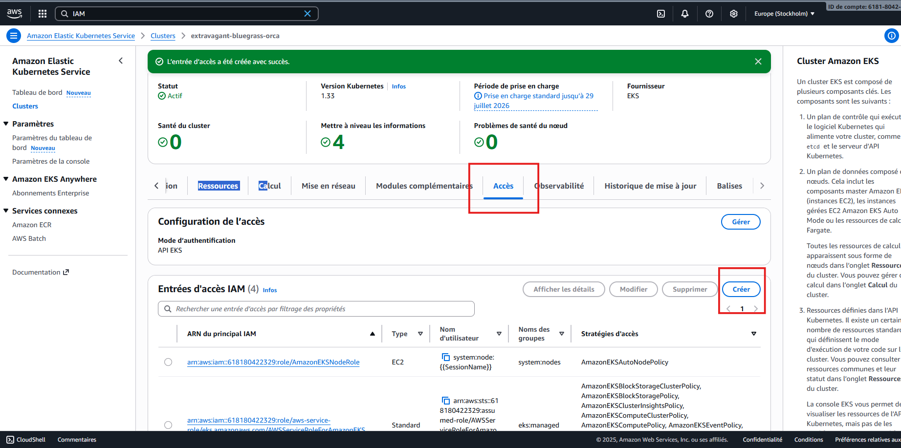
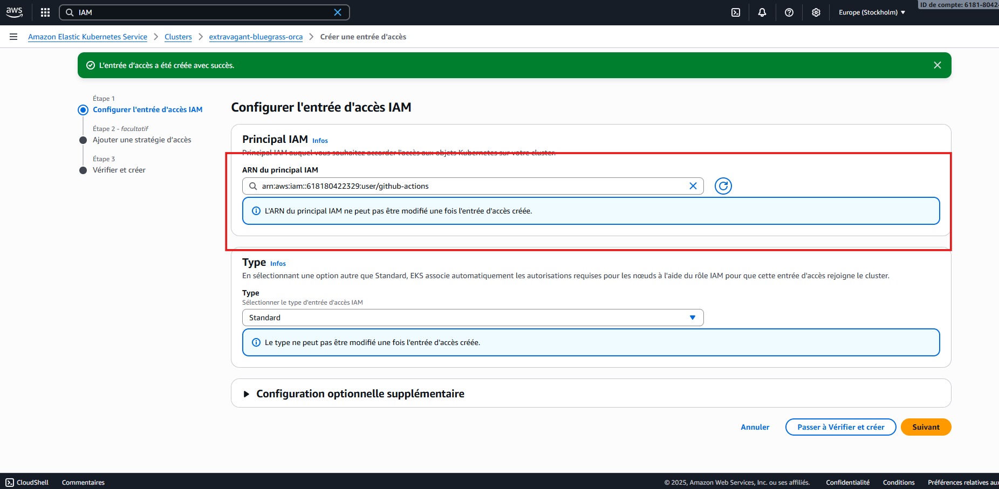
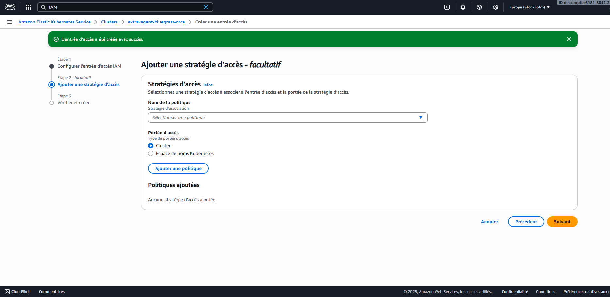
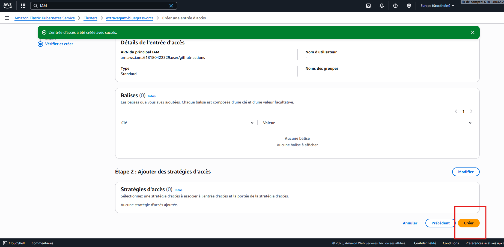
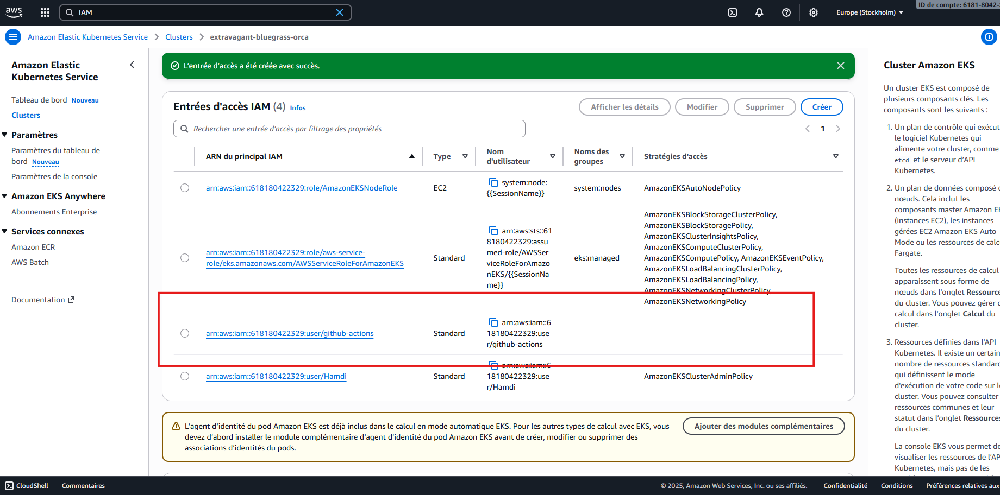

## Granting GitHub Actions Access to EKS

When a GitHub Actions workflow deploys to an EKS cluster using Helm, it authenticates with an **IAM user** (for example, `github-actions`) defined by the secrets
`AWS_ACCESS_KEY_ID` and `AWS_SECRET_ACCESS_KEY`.

By default, this IAM user **does not have Kubernetes-level (RBAC) permissions**, so it cannot list or create Kubernetes resources such as `secrets`, `pods`, or `deployments`.
To fix this, we must explicitly grant the IAM user **cluster-admin** privileges inside the EKS cluster.

---

### Step 1 – Connect to the cluster using AWS CloudShell

1. Open **AWS CloudShell** from the AWS Console (top right corner).
2. Connect to your EKS cluster by running:

   ```bash
   aws eks update-kubeconfig --name extravagant-bluegrass-orca --region eu-north-1
   ```

   This command configures `kubectl` to communicate with your EKS cluster.

---

### Step 2 – Create a ClusterRoleBinding for the GitHub IAM user

Run the following command directly in CloudShell:

```bash
kubectl apply -f - <<'EOF'
apiVersion: rbac.authorization.k8s.io/v1
kind: ClusterRoleBinding
metadata:
  name: github-actions-admin
roleRef:
  apiGroup: rbac.authorization.k8s.io
  kind: ClusterRole
  name: cluster-admin
subjects:
  - kind: User
    name: arn:aws:iam::618180422329:user/github-actions
    apiGroup: rbac.authorization.k8s.io
EOF
```

This creates a **ClusterRoleBinding** named `github-actions-admin` that links the IAM user `github-actions` to the `cluster-admin` role.
It gives the GitHub Actions workflow full access to manage all Kubernetes resources in the cluster.

---

### Step 3 – Register the IAM user in the EKS Access UI

In the AWS Console:

1. Go to **EKS → Clusters → voting-app → Access**.
   
2. Click **Add access entry**.
3. For **Principal type**, choose **IAM user**, then select your `github-actions` user.
   
4. Do **not** add any access policies — this step is optional.
  
5. Click **Create**.
   
This UI action registers the IAM user with the EKS cluster’s access control system.
   
Combined with the previous `ClusterRoleBinding`, it ensures that GitHub Actions can both **authenticate** (via IAM) and **authorize** (via RBAC) to manage Kubernetes resources.

---

### Goal

By combining both steps:

* **EKS Access Entry** → allows the IAM user to connect to the cluster.
* **ClusterRoleBinding** → gives that user Kubernetes admin privileges.

Together, they enable your GitHub Actions pipeline to perform Helm deployments and manage resources seamlessly within EKS.
